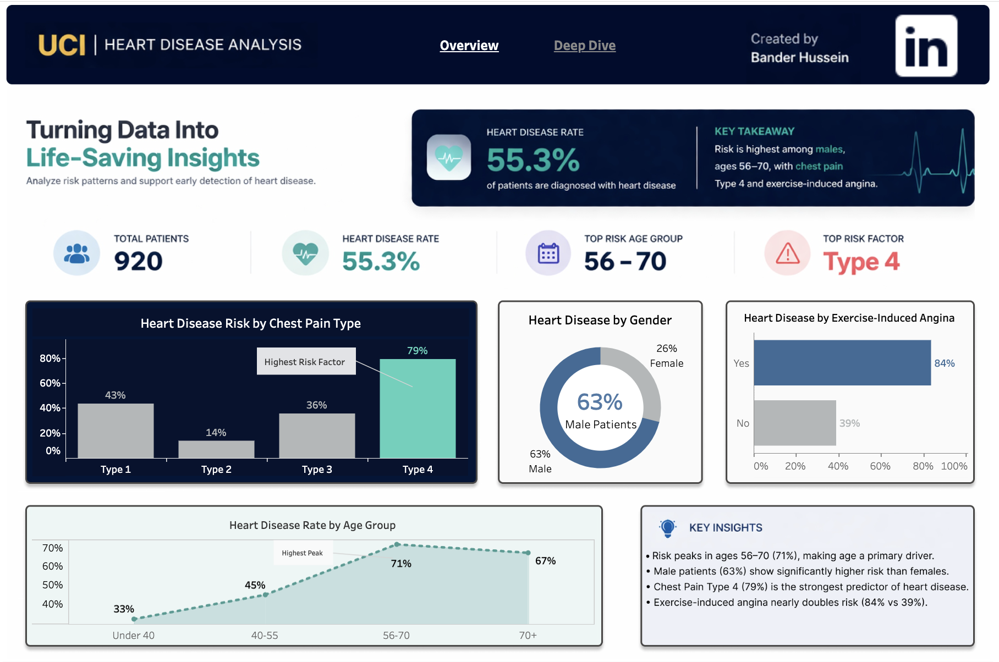
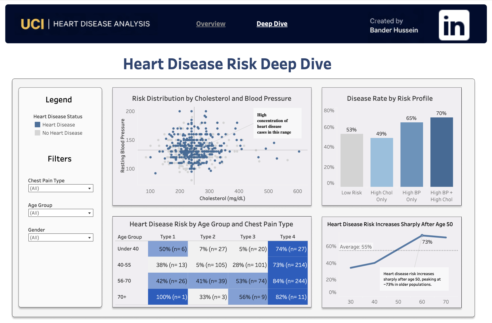

# Heart Disease Risk Analysis (SQL + Python + Tableau)

## Overview
This project analyzes clinical and demographic factors contributing to heart disease risk using a dataset of 900+ patients. The goal is to identify key drivers of risk and present insights through an executive-level dashboard designed for decision-making.

---

## Data Source
The dataset used in this project is the **UCI Heart Disease dataset**, accessed via Kaggle:

🔗 https://www.kaggle.com/datasets/hamnawaseem112222222/uci-heart-disease-dataset

This dataset originates from the **University of California, Irvine (UCI) Machine Learning Repository**.

---

## Business Problem
Heart disease remains one of the leading causes of death worldwide. This project aims to:
- Identify high-risk patient segments
- Understand key contributing factors
- Support early detection and prevention strategies

---

## Tools & Technologies
- SQL (data cleaning, transformation, feature engineering)
- Python (Pandas, NumPy, data analysis, modeling)
- Tableau (dashboard design and data visualization)

---

## Data Preparation
- Handled missing values across multiple clinical features
- Standardized and cleaned raw patient data
- Engineered key features:
  - High Blood Pressure flag
  - High Cholesterol flag
  - High Heart Rate flag
- Created a structured dataset for analysis and visualization

---

## Key Insights
- Heart disease risk peaks between ages **56–70 (~71%)**
- **Chest Pain Type 4 (~79%)** is the strongest predictor of heart disease
- Male patients show significantly higher risk (**~63%**) compared to females
- Patients with both **high blood pressure and high cholesterol (~70%)** have the highest combined risk
- Exercise-induced angina nearly doubles risk (**84% vs 39%**)

---

## Model Performance
- Built a classification model achieving **~79% accuracy**
- Identified key predictive features:
  - Sex
  - Exercise-induced angina
  - Chest pain type
  - Blood pressure

---

## Dashboard

🔗 https://public.tableau.com/app/profile/bander.hussein/viz/UCIHeartDiseaseAnalysis/Overview

### Executive Overview
Provides a high-level summary of:
- Total patients
- Overall disease rate
- Top risk factors
- Demographic insights

---

### Deep Dive Analysis
Explores detailed relationships between variables:
- Risk distribution across clinical factors
- Age and chest pain interactions
- Cholesterol vs blood pressure patterns
- Risk segmentation by profile

---

## Project Structure
- 01_sql/ → Data cleaning, transformation, feature engineering
- 02_python/ → Data analysis and modeling
- Data/ → Raw and processed datasets
- Visuals/ → Dashboard screenshots

---

## Key Takeaway
This project demonstrates an end-to-end analytics workflow:
- Data cleaning (SQL)
- Feature engineering (SQL + Python)
- Analysis & modeling (Python)
- Business storytelling (Tableau)

---

## Author
**Bander Hussein**
